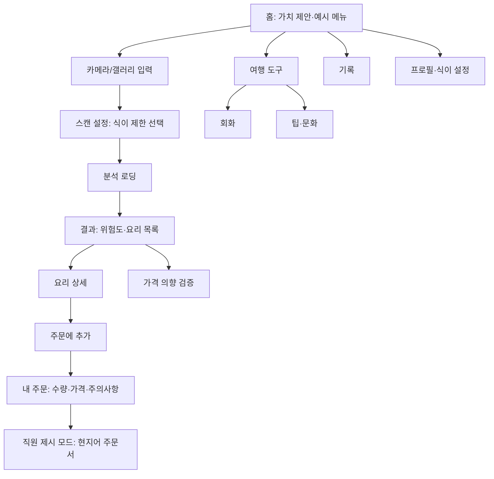
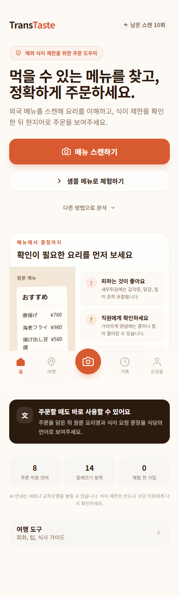
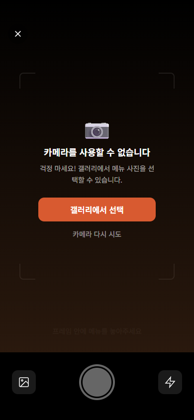
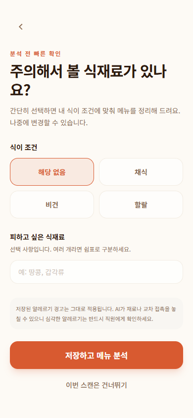
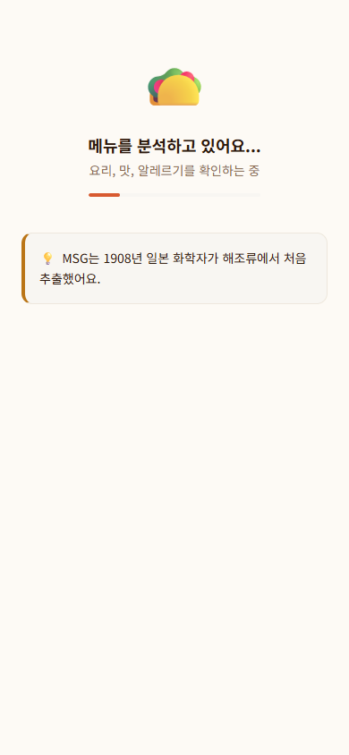
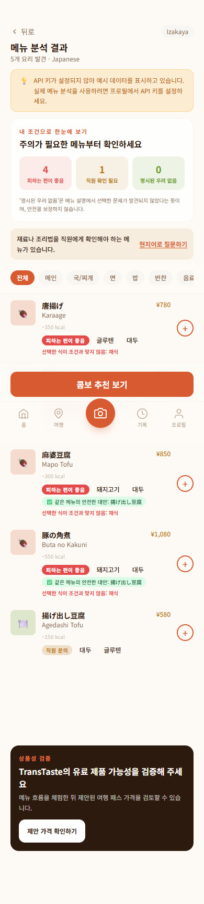
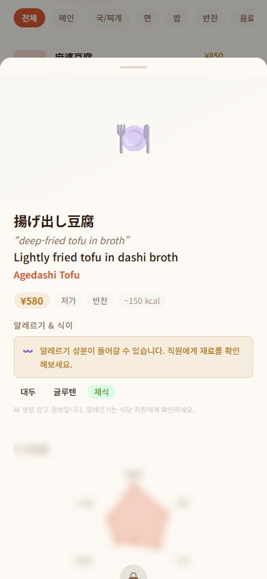
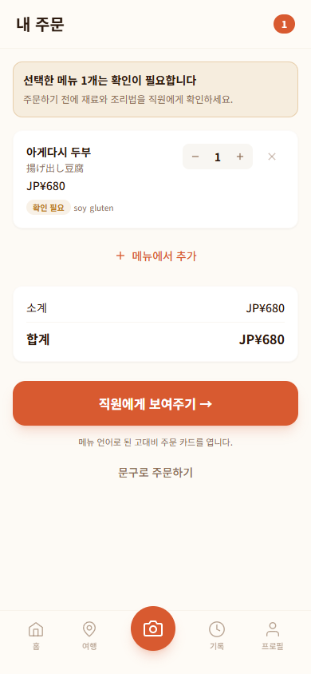
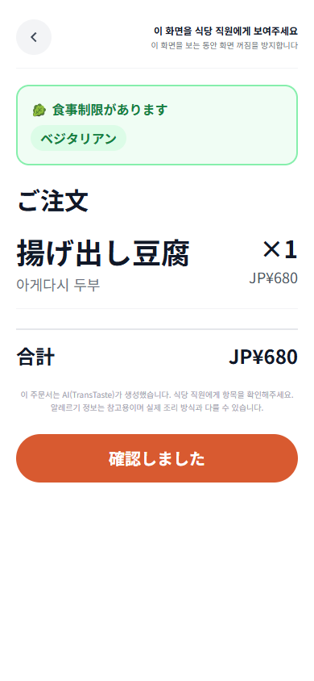
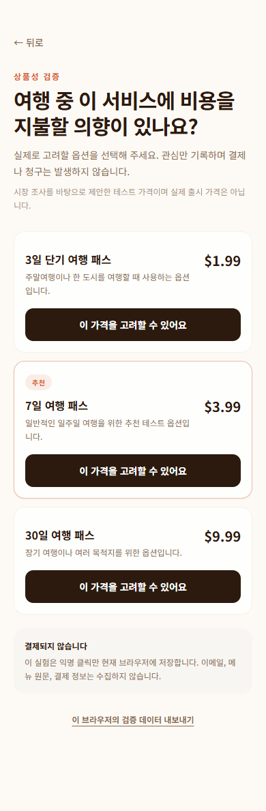

# TransTaste 로컬 데모 전수 QA

- 점검일: 2026-07-30
- 대상: 로컬 production build (`http://127.0.0.1:3000`)
- 화면 조건: Chromium, 모바일 뷰포트 390 × 844, 한국어 UI, 홈 통화 JPY
- 데모 조건: `ENABLE_DEMO_ANALYSIS=true`, Anthropic/Supabase/Stripe 키 없음
- 범위: 21개 라우트, 대표 동적 콘텐츠 2종, 분석·주문 핵심 플로우, 가격 검증, 빈 상태, 반응형 UI, 콘솔 및 API 경계

## 1. 결론

로컬 데모는 **사용자 가치 제안과 핵심 여정 시연이 가능한 상태**다. 메뉴 입력 → 식이 제한 선택 → 분석 → 위험도 확인 → 요리 상세 → 주문 담기 → 직원에게 현지어 주문서 제시까지 한 흐름으로 연결된다. 점검한 21개 라우트는 모두 HTTP 200으로 렌더링되었고, 보조 콘텐츠 페이지 순회 중 콘솔 오류는 없었다.

다만 현재 상태를 실제 프로덕션으로 배포해서는 안 된다. 데모 분석은 명시적 플래그가 있을 때만 동작하고 기존 코드 이슈는 후속 수정했지만, 실 AI 품질·인증·데이터 저장·결제는 검증되지 않았다. 출시 전에는 실제 보조기기·모바일 카메라 검증과 프로덕션 외부 서비스 연결 및 E2E 재검증이 필요하다.

### 종합 판정

| 영역 | 판정 | 근거 |
|---|---|---|
| 로컬 데모 | PASS | 핵심 플로우 완주, 21개 라우트 HTTP 200 |
| 기능 연결성 | PASS | 분석·상세·카트·주문 제시 연결 |
| UI 일관성 | PASS | 색상, 카드, CTA, 하단 내비게이션 체계가 일관됨 |
| 모바일 UX | PASS | 주요 CTA와 가로 스크롤 힌트, 장문 탐색 동선 확인 |
| 접근성 | PASS (코드 기준) | 아이콘 이름·선택 상태·진행 상태 의미 구조 반영, 실제 보조기기 검증은 남음 |
| 실서비스 준비 | HOLD | 실 AI, Supabase, Stripe, 실제 카메라 및 네트워크 실패 복구 미검증 |

## 2. 핵심 사용자 흐름

### 기능 경계 확인

| 경계 | 확인 내용 | 결과 |
|---|---|---|
| 브라우저 → 분석 API | 데모 입력 전송, 응답 수신 | PASS, `200`, `demo: true`, 요리 5개 |
| 잘못된 요청 → API | 필수 입력 없는 요청 | PASS, `400` |
| 프로덕션 안전장치 | API 키 없이 데모 플래그가 꺼진 경우 | PASS, `503 E_SERVICE_UNAVAILABLE` 설계 확인 |
| API → 결과 UI | 식이 제한을 반영한 위험도와 대안 표시 | PASS |
| 결과 → 카트 | 요리 1개 추가 및 주문 수량 반영 | PASS |
| 카트 → 직원 제시 화면 | 메뉴 언어·주의사항·합계 전달 | PASS |
| 가격 검증 | 7일 패스 관심 클릭 및 브라우저 이벤트 저장 | PASS |

## 3. 핵심 플로우 화면 QA

### 3.1 홈

- 목적: 첫 방문자가 서비스 용도와 스캔 CTA를 즉시 이해하게 한다.
- 기능: 카메라 진입, 예시 메뉴 진입, 여행·기록·프로필 내비게이션.
- UX: 핵심 문구와 CTA의 우선순위가 명확하다. API 키가 없는 환경임을 데모 배너로 고지해 오해를 줄인다.
- 판정: PASS.

### 3.2 카메라

- 목적: 메뉴 사진 촬영 또는 대체 입력을 제공한다.
- 기능: 카메라 권한 시도, 사용 불가 시 갤러리/대체 경로.
- UX: 헤드리스 환경에서 카메라가 없어도 빈 화면 대신 복구 가능한 안내를 표시했다.
- 후속 개선: 아이콘 전용 버튼에 접근 가능한 이름·상태·포커스 링을 추가하고, 촬영 또는 갤러리 선택 후 분석 전 미리보기 확인 단계를 추가했다.
- 판정: PASS (실기기 카메라·스크린리더 검증은 출시 전 게이트).

### 3.3 스캔 설정

- 목적: 분석 전에 알레르기·식이 선호를 빠르게 적용한다.
- 기능: 채식 등 퀵 선택, 분석 시작.
- UX: 분석 전 안전 조건을 재확인하는 위치가 적절하다. 선택 상태의 시각적 구분도 명확하다.
- 판정: PASS.

### 3.4 분석 로딩

- 목적: 긴 분석 대기 중 이탈과 중복 제출을 방지한다.
- 기능: 진행 안내, 분석 API 호출, 성공 시 결과 이동, 구조화 오류 표시.
- UX: 빈 화면 없이 메뉴 읽기 → 요리 파악 → 안전 확인 단계를 순차 표시하고 진행 상태를 보조기기에도 전달한다.
- 판정: PASS.

### 3.5 분석 결과

- 목적: 메뉴를 안전성 기준으로 빠르게 판단하고 주문 후보를 찾게 한다.
- 기능: 위험도 분류, 식이 제한 반영, 요리 상세, 안전한 대안, 주문 추가.
- 검증: 채식 선택 시 5개 중 4개가 `피하는 편이 좋음`, 1개가 `직원 확인`으로 분류되었다. 육류 요리의 대안에는 채식 조건에 맞는 아게다시 두부만 노출되어 위험한 대안이 필터링되었다.
- UX: 위험도 색상과 개수 요약이 스캔 결과를 빠르게 훑는 데 효과적이다. 결과가 길어도 판단 기준이 반복되어 맥락을 잃지 않는다.
- 판정: PASS.

### 3.6 요리 상세

- 목적: 원문명, 번역명, 재료·알레르기 위험, 대안을 확인한 후 주문 여부를 결정한다.
- 기능: 상세 정보 요청, 잠금 미리보기, 주문 추가.
- UX: 상세 정보와 주문 CTA가 같은 바텀시트에서 유지되어 흐름이 끊기지 않는다.
- 후속 개선: `/api/analyze/detail`도 명시적 데모 플래그를 따르도록 맞춰 불필요한 `422` 요청을 제거했다.
- 판정: PASS.

### 3.7 내 주문

- 목적: 선택 요리, 수량, 가격, 주의사항을 최종 확인한다.
- 기능: 수량 변경, 제거, 메뉴 추가, 합계, 직원 제시 모드 이동.
- UX: `확인 필요` 경고가 합계보다 먼저 보여 안전 우선순위가 좋다. 주 CTA가 화면 하단에서 충분히 크고 명확하다.
- 판정: PASS.

### 3.8 직원 제시 모드

- 목적: 사용자가 말하지 않아도 식당 직원에게 주문과 식이 제한을 전달한다.
- 기능: 현지어 주문명, 수량, 가격, 식이 제한, 확인 완료.
- UX: 직원이 읽을 텍스트는 일본어로 크게, 사용자 안내는 한국어로 작게 분리했다. 실제 식당에서 화면을 건네는 상황에 잘 맞는다.
- 주의: AI 번역 결과는 실제 모델과 원어민 검수가 아직 필요하다.
- 판정: PASS.

### 3.9 가격 의향 검증

- 목적: 결제 구현 전에 3일/7일/30일 여행 패스의 지불 의향을 측정한다.
- 기능: 플랜별 관심 클릭, 선택 완료 피드백, 브라우저 검증 데이터 내보내기.
- 검증: 7일 패스 클릭 후 문구가 `관심이 기록됐어요 ✓`로 변경되고 `purchase_intent_clicked` 이벤트와 `pass_7d` 속성이 로컬 저장소에 기록되었다. 실제 결제·청구가 없다는 안내도 명시적이다.
- UX: Stripe 투자 전 상품성 검증 장치로 적절하며 선택 버튼의 상태도 보조기기에 전달한다.
- 판정: PASS.

## 4. 보조 기능 및 콘텐츠 페이지

| 화면 | 기능/흐름 | QA 결과 | UI/UX 관찰 | 증거 |
|---|---|---|---|---|
| 여행 도구 `/travel` | 회화, 팁·문화, 주문 진입 | PASS | 가로 목록 양끝 힌트와 퀵 문장별 회화 딥링크를 제공한다 | [스크린샷](../output/playwright/qa-doc-10-travel-ko.png) |
| 회화 `/phrases` | 8개 언어, 상황별 문장·응답 | PASS | 현지어·발음·응답을 한 화면에서 제공해 현장성이 높다. 콘텐츠가 길어 검색/즐겨찾기가 후속 개선 후보 | [스크린샷](../output/playwright/qa-doc-11-phrases-ko.png) |
| 팁·문화 `/tip-culture` | 30개 이상 국가별 팁·예절 | PASS | 국가 선택 범위가 넓고 7일 숨김 기능이 반복 노출 피로를 줄인다 | [스크린샷](../output/playwright/qa-doc-12-tip-culture-ko.png) |
| 기록 `/history` | 최근 스캔 기록, 빈 상태 CTA | PASS | 기록이 없을 때 이유와 다음 행동이 명확하다 | [스크린샷](../output/playwright/qa-doc-13-history-ko.png) |
| 프로필 `/profile` | 언어·통화·알레르기·식이·팁 가이드·계정 | PASS | 상단 고정 섹션 바로가기로 긴 설정 화면의 탐색 비용을 줄였다 | [스크린샷](../output/playwright/qa-doc-14-profile-ko.png) |
| 온보딩 `/onboarding` | 가치 설명, 언어·통화·안전 설정 | PASS | 건너뛰기와 빠른 시작이 있으며 안전 설정을 초기에 수집한다 | [스크린샷](../output/playwright/qa-doc-15-onboarding-ko.png) |
| FAQ `/faq` | 7개 질문 아코디언 | PASS | 첫 항목 열기/닫기 상호작용 확인 | [스크린샷](../output/playwright/qa-doc-16-faq-ko.png) |
| 음식 가이드 `/foods` | 음식 탐색·SEO 진입점 | PASS | 56개 링크가 정상 노출되며 정보 밀도가 높다 | [스크린샷](../output/playwright/qa-doc-17-foods-ko.png) |
| 음식 상세 `/foods/bulgogi` | 대표 음식 설명·안전 정보 | PASS | 검색 유입 후 제품 스캔으로 연결할 수 있는 콘텐츠 자산 | [스크린샷](../output/playwright/qa-doc-18-food-bulgogi-ko.png) |
| 국가 가이드 `/guide` | 국가별 식사 문화 탐색 | PASS | 40개 링크가 정상 노출됨 | [스크린샷](../output/playwright/qa-doc-19-guide-ko.png) |
| 일본 가이드 `/guide/jp` | 일본 팁·예절·식당 정보 | PASS | 여행 전 탐색과 현장 사용을 연결하기 좋음 | [스크린샷](../output/playwright/qa-doc-20-guide-jp-ko.png) |
| 개인정보 `/privacy` | 데이터 처리 고지 | PASS | 모바일 가독성과 하단의 약관·맨 위 이동 동선 확인 | [스크린샷](../output/playwright/qa-doc-21-privacy-ko.png) |
| 이용약관 `/terms` | 서비스 조건·면책 | PASS | 하단의 개인정보·맨 위 이동 동선 확인 | [스크린샷](../output/playwright/qa-doc-22-terms-ko.png) |

## 5. 이슈 목록과 우선순위

| 우선순위 | 이슈 | 처리 내용 | 상태 | 남은 게이트 |
|---|---|---|---|---|
| P1 | 카메라 아이콘 접근성 | 문맥별 `aria-label`, 상태, 포커스 링 반영 | 해결 | 실제 스크린리더 스모크 |
| P2 | 데모 상세 API 422 | 상세 API도 명시적 데모 플래그 지원 | 해결 | 실 AI 상세 품질 평가 |
| P2 | 여행 가로 목록·퀵 문장 탐색 | 스크롤 힌트와 문장·언어 딥링크 반영 | 해결 | 실제 모바일 터치 확인 |
| P2 | 가격 선택 상태 접근성 | `aria-pressed` 반영 | 해결 | 실제 보조기기 확인 |
| P2 | 분석 로딩 단일 상태 | 단계형 진행 및 재시도 안내 반영 | 해결 | 느린 실 API에서 타이밍 조정 |
| P3 | 프로필과 장문 콘텐츠 탐색 | 프로필 고정 섹션 링크, 법률 문서 맨 위 이동 추가 | 해결 | 콘텐츠 확장 시 목차 재검토 |

## 6. 상품 관점 평가

### 강점

- **가치가 발생하는 순간이 빠르다.** 사용자는 메뉴 전체를 읽지 못해도 위험한 요리와 주문 가능한 후보를 즉시 구분한다.
- **분석에서 행동까지 연결된다.** 번역 결과만 보여주는 도구가 아니라 주문 담기와 직원 제시까지 이어져 현장 문제를 닫는다.
- **안전 맥락이 제품 전반에 유지된다.** 식이 선택, 결과 위험도, 주문 경고, 직원 제시 화면이 같은 조건을 공유한다.
- **수익화 전 검증 장치가 있다.** Stripe 없이도 가격 관심 이벤트를 수집해 결제 개발 투자 판단을 할 수 있다.
- **콘텐츠 유입 자산이 있다.** 음식·국가·회화·팁 콘텐츠는 검색 유입과 재방문을 만들 수 있다.

### 리스크

- 핵심 신뢰는 AI 번역과 알레르기 판단 정확도에 달려 있으나 이번 QA는 고정 데모 데이터만 검증했다.
- 카메라 실기기, 저조도·기울어진 메뉴, 다국어 혼합 메뉴, 느린 모바일 네트워크는 검증하지 못했다.
- Supabase가 없어 계정 간 기록 동기화·데이터 보존·동의 철회를 검증하지 못했다.
- Stripe가 없어 실제 결제 성공·실패·환불·중복 결제 방지를 검증하지 못했다.
- 법률 문구가 있어도 의료·알레르기 안전 주장과 데이터 처리 방식은 실제 운영 구조에 맞춘 별도 검토가 필요하다.

## 7. 다음 QA 게이트

1. 실제 키보드·스크린리더와 모바일 터치 환경에서 접근성 스모크 테스트.
2. 실제 Anthropic 키를 Preview 환경에만 연결한 뒤 20개 메뉴 이미지 정확도 평가.
3. 실제 iOS Safari/Android Chrome에서 카메라·미리보기·갤러리·회전·권한 거부 테스트.
4. Supabase 도입 시 익명→로그인 전환, 기록 동기화, 삭제/탈퇴 E2E.
5. Stripe 도입 여부는 가격 관심 이벤트와 인터뷰 결과가 기준치를 넘은 뒤 결정.
6. 프로덕션 배포 전 `ENABLE_DEMO_ANALYSIS` 미설정, 비밀 키 노출 없음, API `503` 복구 UI를 재검증.

## 8. 범위와 제한

- 실제 카메라는 헤드리스 Chromium에서 사용할 수 없어 카메라 불가 복구 상태를 검증했다.
- 음식 상세는 불고기, 국가 상세는 일본을 대표 표본으로 점검했다. 정적 데이터 전체의 문장 정확성은 별도 콘텐츠 검수가 필요하다.
- 실제 AI, Supabase, Stripe 기능은 키가 없어 대상에서 제외했다.
- 전체 스크린샷은 `output/playwright/qa-doc-01`부터 `qa-doc-22`까지 보존했다.

## 9. QA 후 즉시 반영한 개선

2026-07-30 후속 수정에서 제품 방침 없이 해결 가능한 항목을 반영했다.

- 카메라의 뒤로가기·갤러리·촬영·플래시 버튼과 다중 이미지 제거 버튼에 접근 가능한 이름 및 상태를 추가했다.
- 가격 관심 버튼에 `aria-pressed`를 추가했다.
- 분석 로딩에 메뉴 읽기 → 요리 파악 → 안전 확인 단계를 표시하고 `aria-live`, `aria-busy`, progressbar 의미 구조를 추가했다.
- 모바일 가로 스크롤 목록 양끝에 페이드 힌트를 추가했다.
- 상세 API도 명시적 데모 플래그에서만 샘플 상세를 반환하도록 맞춰 데모의 422 오류를 제거했다.
- 이미 구현된 주문 화면을 여행 도구에서 `준비 중`으로 막던 표시를 제거했다.
- Stripe 미설정 시 성공으로 우회하던 checkout과 클라이언트 로컬 권한 부여를 제거했다.
- 결제 성공 쿼리만으로 패스·크레딧·상세 권한을 부여하지 않도록 닫았다.
- 촬영·갤러리 선택 후 이미지 미리보기와 분석 확인 단계를 추가했다.
- 여행 퀵 문장을 해당 언어·문장 카드로 바로 이동시키고 포커스·하이라이트를 제공했다.
- 프로필 고정 섹션 링크와 법률 문서 맨 위 이동을 추가했다.

후속 빌드·브라우저 회귀 확인:

- ESLint, 한·영 번역 키 동기화, production build 통과.
- 회화 딥링크 진입 시 `phrase-water_please` 카드로 포커스되고 일본어 문장이 노출됨을 확인.
- 카메라가 없는 환경에서 갤러리 이미지 1개 선택 후 분석 전 미리보기·취소·분석 CTA가 노출됨을 확인.
- 프로필 `Account` 섹션 링크 선택 시 `#profile-account`로 이동함을 확인.
- 점검 흐름에서 브라우저 콘솔 오류 0건.

제품 책임자의 선택이 필요한 후속 항목은 [제품 방침 결정 목록](./260730_product_policy_decisions.md)에 분리했다.
